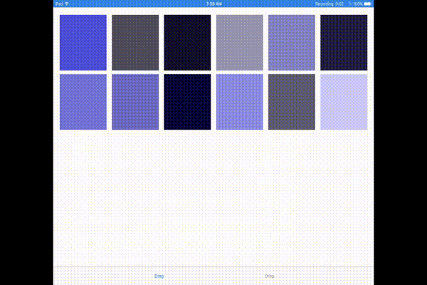
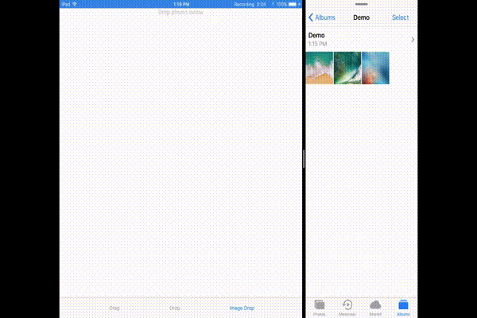

# Drag and Drop

An example of how to use the Drag and Drop API to copy information from one collection view to another.

Drag and Drop is an extremely powerful feature for iOS.  Being able to seamlessly drop data into one app from another and have it "just work" is one of the best user experience updates made to the platform in a long while.

Being able to support this in applications is more than likely going to become a community standard amongst applications.  You likely won't notice the apps that do support Drag and Drop but you will remember the ones that don't.  Users will come to expect an image app to support dropping (and most likely also dragging to) images from other applications.





### Usage
#### Collection (and Table) Views

Everything discussed below about collection views also applies to table view using the `UITableViewDragDelegate` and `UITableViewDropDelegate`
###### Drag
Incorporating the Drag functionality into a collection view is remarkably easy.  Simply conform to `UICollectionViewDragDelegate`, set your controller as the `dragDelegate` of the collection view, enable `dragInteractionEnabled` on the collection view, and implement the required function:
```swift
// Tells the new drag session what it will be dragging
func collectionView(_ collectionView: UICollectionView, itemsForBeginning session: UIDragSession, at indexPath: IndexPath) -> [UIDragItem] {
    let color = colors[indexPath.item]
    let dragItem = UIDragItem(itemProvider: NSItemProvider(object: color))
    dragItem.localObject = color

    return [dragItem]
}
```
This is the only required function the drag delegate must implement but you can only leverage the true customization powers of Drag by using the optional functions.  During the WWDC sessions on Drag and Drop, the Apple engineers strongly urged developers to use the optional function whenever possible to give a rich, custom user experience in your app.

###### Drop
Adding Drop functionality to a collection view is just as easy as adding Drag.  Have your collection view conform to `UICollectionViewDropDelegate`, set your controller as the `dropDelegate`, and implement the required function:
```swift
func collectionView(_ collectionView: UICollectionView, performDropWith coordinator: UICollectionViewDropCoordinator) {
    // Grab the initial destination indexPath for the drop item(s)
    let destinationIndexPath = coordinator.destinationIndexPath ?? IndexPath(item: 0, section: 0)
    var destinationIndex = destinationIndexPath.item

    for item in coordinator.items {
        guard let newColor = item.dragItem.localObject as? UIColor else { continue }

        // Insert the new item into the data source and collection view
        let insertionIndexPath = IndexPath(item: destinationIndex, section: 0)
        collectionView.performBatchUpdates({
            self.addColor(newColor, at: insertionIndexPath)
            collectionView.insertItems(at: [insertionIndexPath])
        })

        // Tells the drop coordinator to drop and animate the item into the `insertionIndexPath`
        // Must be called _after_ `performBatchUpdates`
        coordinator.drop(item.dragItem, toItemAt: insertionIndexPath)

        // If dealing with more than one item, update the destinationIndex by 1
        destinationIndex += 1
    }
}
```
Just as with Drag, this is the only required function the drop delegate must implement but you can fully customize the experience by implementing the optional functions.

And that's it.  Two functions and three collection/table view properties and you can support Drag and Drop in your application's table or collection view!

###### Loading Data
Drag and Drop allows you to share certain data with other applications such as text or images.  This data is loaded asynchronously using an `NSItemProvider` and a `UICollectionViewDropPlaceholderContext`.  

Instead of using the coordinator to drop the `dragItem` directly, have the coordinator add a placeholder cell to the collection view:
```swift
placeholderContext = coordinator.drop(item.dragItem,
                                      toPlaceholderInsertedAt: destinationIndexPath,
                                      withReuseIdentifier: "placeholderCell",
                                      cellUpdateHandler: { (cell) in
    guard let placeholderCell = cell as? ImagePlaceholderCollectionViewCell else { return }
    placeholderCell.configure(with: progress)
})
```

#### Standalone elements
Coming Soon!

### Related Documentation
Introduction to Drag and Drop [WWDC video](https://developer.apple.com/videos/play/wwdc2017/203/)

Mastering Drag and Drop [WWDC Video](https://developer.apple.com/videos/play/wwdc2017/213/)

[Drag and Drop Documentation](https://developer.apple.com/documentation/uikit/drag_and_drop)

[NSItemProvider Documentation](https://developer.apple.com/documentation/foundation/nsitemprovider)

[Apple Human Interface Guidelines](https://developer.apple.com/ios/human-interface-guidelines/interaction/drag-and-drop/)
